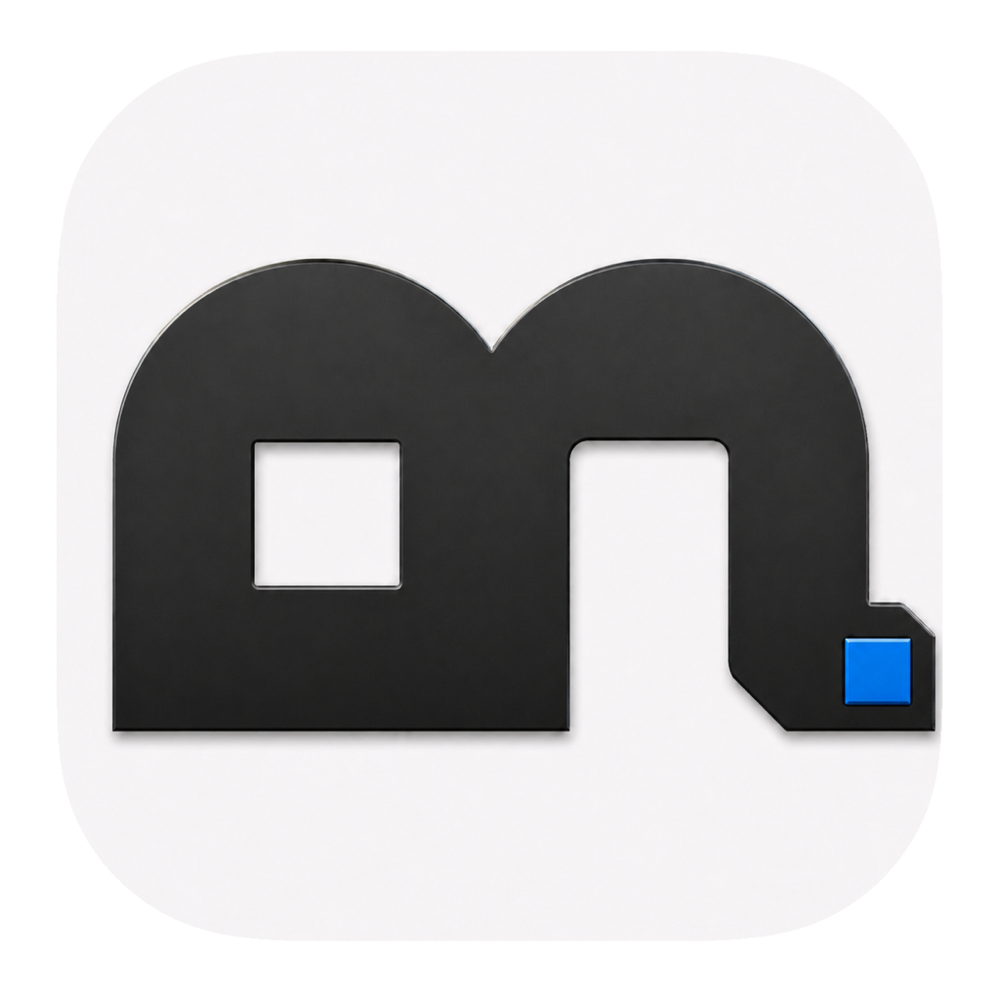

<p align="center">
  
</p>

<h1 align="center">Mirage</h1>

<p align="center"><strong>把图片素材带进 macOS 文件选择器。</strong></p>

<p align="center">
  浏览 Openverse 图片与 DiceBear 头像，按需收藏，并直接在上传面板中选择。<br>
  不必先下载、整理文件，再回到原来的窗口上传。
</p>

<p align="center">
  
  
  
</p>

<p align="center">
  <a href="https://github.com/shaun17/Mirage/releases">下载</a> ·
  <a href="#快速开始">快速开始</a> ·
  <a href="#从源码构建">从源码构建</a>
</p>

## Mirage 是什么？

Mirage 是一款 macOS 图片素材工具。主应用负责发现、搜索、查看和收藏素材；内置的 File Provider 扩展则让 Mirage 出现在 Finder 与系统文件面板的“位置”中。

当 App 或网页调用 macOS 系统文件面板选择图片时，可以直接打开 Mirage，浏览推荐内容、收藏和最近使用的素材。确认选择后，Mirage 获取源图并交付标准化的 PNG 文件。

## 功能

- **两类素材来源** — 浏览 Openverse 图片与 DiceBear 头像，并可切换“头像”“图片”或“全部”。
- **搜索与发现** — 按关键词搜索素材，继续分页浏览更多结果。
- **收藏与最近使用** — 主应用中的收藏会同步到文件面板；成功选择的素材会进入最近使用。
- **系统文件面板接入** — 通过 macOS File Provider，在支持系统文件面板的上传场景中直接选择素材。
- **统一图片输出** — 对源图进行校验、方向修正和居中裁切，输出 512 × 512 sRGB PNG，并移除源文件元数据。
- **来源信息** — 在详情中查看素材来源、作者、来源页与许可证信息。
- **只读设计** — Mirage 只提供浏览和选择，不创建、修改或删除远端素材。

---

## 安装

正式安装包发布后：

1. 前往 [GitHub Releases](https://github.com/shaun17/Mirage/releases) 下载最新的 `Mirage-<版本>.dmg`。
2. 打开 DMG，将 Mirage 拖入 `Applications`。
3. 首次启动 Mirage，等待文件提供程序完成初始化。
4. 如果应用提示扩展尚未启用，请前往“系统设置 → 通用 → 登录项与扩展 → 文件提供程序”，启用 Mirage。

Releases 只应提供经过 Developer ID 签名、Apple 公证并通过 Gatekeeper 校验的正式 DMG；名称中带 `-development` 的构建仅用于本机开发验证。

## 快速开始

1. 在 Mirage 中浏览或搜索图片，按需收藏素材。
2. 在目标 App 或网页中打开上传框。
3. 在系统文件面板左侧的“位置”中选择 Mirage。
4. 打开推荐内容、“头像”“收藏”或“最近使用”；每层末尾可通过“更多图片”继续浏览。
5. 选择素材，Mirage 会生成 512 × 512 PNG 并交给目标 App。

> Mirage 主应用不会替目标 App 上传文件。它只在系统文件面板中提供素材，最终上传仍由目标 App 完成。

## 工作方式

```text
Mirage 主应用 ── 浏览 · 搜索 · 收藏 · 查看来源
         │  通过 App Group 同步收藏与推荐快照
         ▼
macOS File Provider ── 推荐 · 收藏 · 最近使用
         │  选择素材
         ▼
获取源图 ── 校验 · 方向修正 · 居中裁切 ── 512 × 512 PNG
```

Mirage 通过 App Group 在主应用与 File Provider 扩展之间共享收藏、最近使用和推荐快照。只有素材成功物化为文件后，才会记入“最近使用”。

## 系统要求

- macOS 14.0 或更高版本。
- 新搜索、图片预览和首次获取远程素材通常需要网络连接。
- File Provider 的远程字符串搜索需要 macOS 26 或更高版本；旧系统仍可浏览已枚举内容并使用系统本地索引。
- File Provider 需要有效签名和一致的 App Group 配置。

## 素材、隐私与边界

- 当前仓库实现中没有账号系统，也没有引入分析或遥测 SDK。
- Openverse 搜索会将关键词通过 HTTPS 发送至 `api.openverse.org`；Mirage 只请求并接纳 CC0 1.0 与 Public Domain Mark 图片。
- DiceBear 查询文字会先在本地转换为摘要 seed，远端请求不包含原始查询文字。
- 选择 Openverse 素材时，Mirage 还需要访问结果指向的第三方 HTTPS 图片主机。
- 收藏、最近使用、推荐快照、File Provider 搜索文字与结果以及同步状态以 JSON 保存在 App Group 容器中，并非加密数据库。
- 生成的 PNG 不包含来源和授权元数据；如许可证要求署名，请自行保留并附上归属信息。

Mirage 展示的来源和许可证信息用于帮助核对，不构成法律保证。使用素材前仍需确认来源页、署名要求、肖像权、商标权及其他适用限制。

---

## 从源码构建

当前工程使用 Xcode 26、Swift 6 和 XcodeGen。

```bash
git clone https://github.com/shaun17/Mirage.git
cd Mirage
xcodegen generate --spec project.yml
open Mirage.xcodeproj
```

在 Xcode 中选择 `Mirage` scheme，并为主应用与 File Provider 扩展配置有效签名。Fork 项目时，需要同时替换 Development Team、两个 Bundle ID 与 App Group。

### 测试

```bash
xcodebuild \
  -project Mirage.xcodeproj \
  -scheme MirageCoreTests \
  -configuration Debug \
  -destination 'platform=macOS' \
  -derivedDataPath /tmp/MirageTestDerivedData \
  test CODE_SIGNING_ALLOWED=NO
```

### 构建 DMG

本机开发验证：

```bash
./Scripts/build_dmg.sh
```

development 模式仍需要可用的 Apple Development 签名。

Developer ID 正式分发：

```bash
NOTARY_KEYCHAIN_PROFILE=MirageNotary \
RELEASE_MODE=developer-id \
./Scripts/build_dmg.sh
```

正式模式要求有效的 Developer ID Application 证书与公证 profile。任何签名、公证、stapling 或 Gatekeeper 校验失败都会终止构建，不会降级发布。

## 当前限制

- Mirage 是只读素材入口，不是云盘或通用文件管理器。
- 输出固定为居中裁切后的 512 × 512 PNG，不保留原始尺寸、格式或 EXIF。
- 外部素材服务可能出现网络错误、限流、内容下架或元数据变化。
- 内容安全过滤依赖来源服务提供的标记和元数据，不能保证所有结果适合所有用户。
- 当前测试覆盖核心逻辑，但不替代真实签名、Finder 枚举和系统上传面板验收。

## 许可证

仓库当前未包含 `LICENSE` 文件，因此不声明 Mirage 源码采用任何开源许可证。
