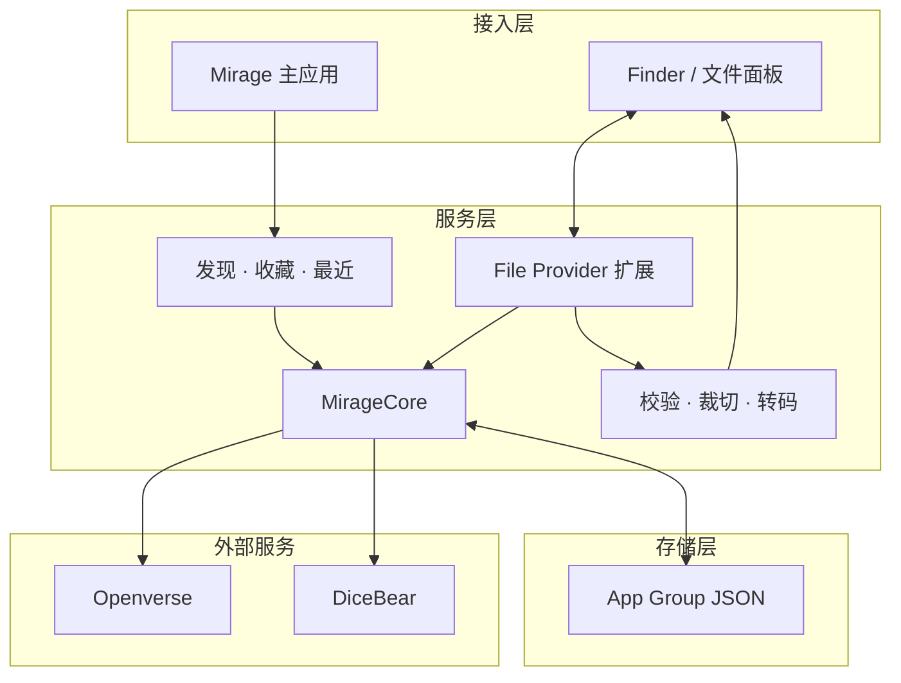

---
tags:
  - project
  - swift
  - macos
  - swiftui
  - file-provider
created: 2026-08-01
---

# Mirage

<p align="center">
  
</p>

> [!NOTE]
> **一句话定位**
>
> Mirage 是一款 macOS 图片素材桥接工具：它把 Openverse 图片与 DiceBear 头像作为只读 File Provider 接入系统文件面板，让用户在支持系统选文件面板的上传场景中直接浏览、搜索并选择标准化的 512×512 PNG。

**版本：** `0.3.0 (16)`<br>
**平台：** `macOS 14.0+`<br>
**语言：** `Swift 6.0`<br>
**界面：** `SwiftUI`

## 整体架构



> [!NOTE]
> 主应用负责发现和管理素材；真正的上传动作始终发生在目标 App 的系统文件面板中。

## 目录结构

```text
Mirage/
├── Sources/
│   ├── MirageApp/           # SwiftUI 主应用、搜索与资料库状态
│   ├── MirageCore/          # 数据模型、远程服务、共享存储与图片转码
│   ├── MirageDetailWindow/  # 详情抽屉布局与窗口尺寸辅助
│   └── MirageFileProvider/  # Finder / File Provider 扩展
├── Tests/
│   └── MirageCoreTests/     # 搜索、存储、分页、转码与 Provider 单元测试
├── Config/                  # Info.plist 与 entitlements
├── Scripts/
│   └── build_dmg.sh         # 签名归档与开发版 DMG 打包
├── Branding/                # App Icon 与品牌素材
├── project.yml              # XcodeGen 配置源
└── Mirage.xcodeproj/        # 已生成的 Xcode 工程
```

## 技术栈与系统要求

| 层级 | 技术 / 版本 | 用途 |
|---|---|---|
| 运行平台 | macOS 14.0+ | 主应用与 File Provider |
| 语言 | Swift 6.0 | 应用、核心模块与扩展 |
| 界面 | SwiftUI + 少量 AppKit 桥接 | 主窗口、网格、详情抽屉和快捷键 |
| 系统集成 | Replicated File Provider | 在 Finder 与系统文件面板中提供只读素材 |
| 图片处理 | ImageIO、Core Graphics | 格式校验、方向修正、中心裁切与 PNG 转码 |
| 本地共享 | App Group + JSON | 跨主应用与扩展共享收藏、最近使用和同步状态 |
| 工程生成 | XcodeGen，版本未锁定 | 由 `project.yml` 生成 Xcode 工程 |
| 构建工具 | Xcode 26.0 / macOS 26 SDK | 编译 Swift 6 与 macOS 26 File Provider 搜索接口 |
| 测试 | XCTest | 核心逻辑与状态机回归测试 |

- 运行应用最低需要 macOS 14。
- File Provider 的远程字符串搜索仅在 macOS 26 及以上可用；旧系统仍可浏览已枚举内容，并使用系统本地索引。
- 工程没有第三方 Swift Package 依赖，但搜索和实际图片获取需要网络。
- 真正运行 File Provider 需要有效的 Apple 开发者签名与一致的 App Group 配置。

## 核心功能

| 功能 | 当前行为 |
|---|---|
| 发现与搜索 | 提供“头像、图片、全部”筛选，默认显示头像；关键词搜索采用 400ms 防抖和 20 条分页 |
| 来源选择 | `头像:` / `avatar:` 仅使用 DiceBear，`图片:` / `photo:` 仅使用 Openverse，“全部”组合两种来源 |
| 推荐内容 | 应用与 File Provider 共用冻结的推荐快照，避免分页期间内容换代导致重复或跳页 |
| 收藏 | 在主应用中收藏或取消收藏，并同步到文件面板的“收藏”目录 |
| 最近使用 | 只有文件成功物化后才记录，单纯预览缩略图不会计入 |
| Finder 浏览 | 根目录展示一批推荐素材及“头像、最近使用、收藏”目录；每层固定 50 张，通过“更多图片”继续浏览 |
| 图片详情 | 展示来源、作者、来源页与许可证，并提示肖像权、商标权等额外限制 |
| 图片交付 | 下载原图后校验格式、字节数和像素数，输出去除源元数据的 512×512 sRGB PNG |
| 只读边界 | File Provider 明确拒绝创建、修改和删除操作 |
| 辅助功能 | 为主要操作提供 VoiceOver 语义，并尊重“减少动态效果”设置 |

## 实际使用流程

1. 启动 Mirage，等待共享资料库和 File Provider 完成初始化。
2. 如果侧栏提示扩展未启用，前往“系统设置 → 通用 → 登录项与扩展 → 文件提供程序”启用 Mirage。
3. 在 Mirage 中浏览、筛选或搜索素材，打开详情核对来源与许可，按需收藏。
4. 在目标 App 中打开上传框或系统文件面板。
5. 从左侧“位置”选择 Mirage。
6. 浏览推荐素材、头像、收藏或最近使用；需要更多内容时打开“更多图片”。
7. 选择文件后，扩展下载原图并生成 512×512 PNG，再把临时文件交给目标 App。
8. 成功选择的素材随后会出现在 Mirage 的“最近使用”中。

## 安装

### 从 GitHub Releases 安装

如果 [GitHub Releases](https://github.com/shaun17/Mirage/releases) 提供可下载构建：

1. 下载发布页中的 `.dmg`。
2. 打开 DMG。
3. 将 Mirage 拖入 `Applications`。

## 构建、运行与测试

### 获取源码

```bash
git clone https://github.com/shaun17/Mirage.git
cd Mirage
open Mirage.xcodeproj
```

在 Xcode 中选择 `Mirage` scheme，配置有效签名后运行。只有修改 `project.yml` 或需要重建工程时才需要 XcodeGen：

```bash
xcodegen generate --spec project.yml
```

### 无签名编译检查

下面的命令可验证主应用及内嵌扩展能否编译，但不能用于验证 File Provider 的真实注册与启用：

```bash
xcodebuild \
  -project Mirage.xcodeproj \
  -scheme Mirage \
  -configuration Debug \
  -destination 'platform=macOS' \
  -derivedDataPath /tmp/MirageDerivedData \
  build CODE_SIGNING_ALLOWED=NO
```

### 运行单元测试

```bash
xcodebuild \
  -project Mirage.xcodeproj \
  -scheme MirageCoreTests \
  -configuration Debug \
  -destination 'platform=macOS' \
  -derivedDataPath /tmp/MirageTestDerivedData \
  test CODE_SIGNING_ALLOWED=NO
```

测试覆盖共享存储、推荐流、搜索与分页、图片转码、缩略图缓存、File Provider 目录规划和同步状态。当前没有自动化的真实 Finder 激活、系统上传面板或实时公网端到端测试。

### 构建 DMG

开发模式用于本机验证：

```bash
./Scripts/build_dmg.sh
```

当前版本生成：

```text
dist/Mirage-0.3.0-development.dmg
dist/Mirage-0.3.0-development.dmg.sha256
```

开发模式仍需要有效的 Apple Development 签名。脚本会重建工程、执行 Release Archive、验证主应用与内嵌扩展签名、校验 DMG，并为最终字节生成 SHA-256。

正式 Developer ID 分发模式：

```bash
NOTARY_KEYCHAIN_PROFILE=MirageNotary RELEASE_MODE=developer-id ./Scripts/build_dmg.sh
```

当前版本生成：

```text
dist/Mirage-0.3.0.dmg
dist/Mirage-0.3.0.dmg.sha256
```

正式模式要求当前团队拥有有效的 Developer ID Application 证书及私钥，并且钥匙串中存在可访问公证服务的 `MirageNotary` profile。缺少任一项、Apple 公证未接受、stapling 或 Gatekeeper 校验失败时，脚本都会直接退出，不会降级为 development 模式或发布未通过验证的正式产物。

## File Provider 与签名配置

当前工程绑定作者的开发团队和 App Group。Fork 或自行构建时，以下值必须作为一组同步修改：

| 配置 | 当前值 | 主要位置 |
|---|---|---|
| Development Team | `N4TQ2P9B46` | `project.yml` |
| 主应用 Bundle ID | `com.wenren.Mirage` | `project.yml` |
| 扩展 Bundle ID | `com.wenren.Mirage.FileProvider` | `project.yml` |
| App Group | `N4TQ2P9B46.group.com.wenren.Mirage` | `project.yml`、`Sources/MirageCore/AppGroupStorage.swift` |
| File Provider Document Group | 同 App Group | `project.yml` |

修改后运行：

```bash
xcodegen generate --spec project.yml
```

主应用与内嵌扩展的 `CFBundleVersion` 也必须保持一致；Mirage 会在注册文件域前检查这两个构建号。

## 隐私与网络

| 范围 | 当前行为 |
|---|---|
| 账号与遥测 | 源码中没有账号系统，也未引入分析或遥测 SDK |
| Openverse 搜索 | “图片”与“全部”搜索会通过 HTTPS 把关键词作为 `q` 参数发送到 `api.openverse.org` |
| DiceBear 头像 | 原始查询文字只参与本地 SHA-256；远端 URL 只包含摘要 seed、风格和尺寸 |
| 图片主机 | 除 `api.dicebear.com` 外，还会访问 Openverse 结果提供的第三方 HTTPS 图片与缩略图主机 |
| 本地数据 | App Group 中以 JSON 保存收藏、最近使用、推荐快照、Finder 当前搜索 backing 与同步状态，不是加密数据库 |
| 缩略图 | 主应用使用内存缓存；File Provider 与 macOS 仍可能维护系统级缓存 |
| 输出内容 | 生成到 File Provider 临时目录，并移除 EXIF 等源元数据 |

File Provider 下载层只接受 HTTPS，并限制响应字节数和图片像素数。网络失败时，推荐流可以生成稳定的 DiceBear 兜底元数据，但实际获取头像 PNG 仍然需要网络，因此 Mirage 不是完全离线应用。

## 素材许可

| 来源 | Mirage 的接纳范围 |
|---|---|
| Openverse | 只请求并接纳 `CC0 1.0` 与 `Public Domain Mark` 的摄影图片 |
| DiceBear | 按具体风格使用 `CC0`、`CC BY 4.0`、`MIT` 或该风格声明的免费使用条款 |

Mirage 会在详情中展示服务方提供的来源、作者和许可证信息，但这些信息仅供核对，不构成法律保证。使用素材前仍需确认来源页、署名要求、肖像权、商标权及其他适用限制。

> [!WARNING]
> 输出 PNG 不嵌入来源或授权元数据。需要署名时，请自行保留并按许可证要求附上归属信息。

仓库当前没有 `LICENSE` 文件，因此本文不声明 Mirage 源码采用任何开源协议。

## 关键限制

- Mirage 是只读素材入口，不是可写云盘或通用文件管理器。
- 交付结果固定为居中裁切后的 512×512 PNG，不保留原始尺寸、文件格式或源元数据。
- Openverse 内容安全策略依赖服务端标记及标题、标签、来源元数据过滤，不能保证所有结果都适合所有用户。
- 外部图片服务可能出现网络错误、限流、内容下架或元数据变化。
- macOS 26 以下没有 File Provider 远程字符串搜索接口。
- 主应用本身不会把文件上传到第三方服务；它只为目标 App 的系统文件面板提供素材。
- 单元测试不替代真实签名、扩展启用、Finder 枚举和上传面板验收。
